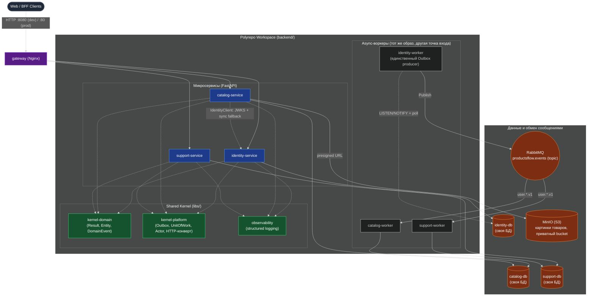
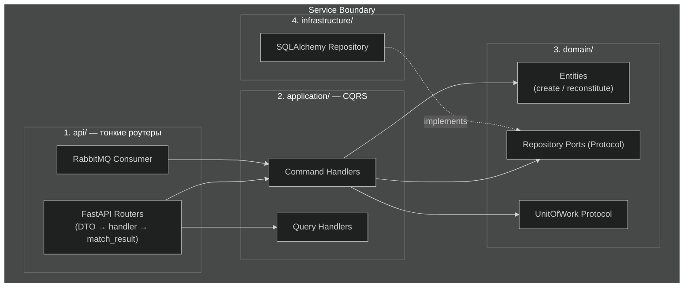

# ProductsFlow

[](https://github.com/PVMalove/ProductsFlow/actions/workflows/ci.yml)

[](LICENSE)

ProductsFlow — распределённая микросервисная платформа для учёта товаров. Архитектура построена на принципах предметно-ориентированного проектирования (DDD), событийно-ориентированного взаимодействия (EDA) и гексагональной архитектуры (Ports & Adapters).

Проект организован по принципу Polyrepo в рамках одного репозитория: три независимо разворачиваемых сервиса, каждый со своим `pyproject.toml`. Зависимости резолвятся в один общий `backend/uv.lock` и `backend/.venv` (общий workspace), что необходимо для E2E-тестов.

Полная архитектурная документация: [ADR-база](docs/adr/README.md) (13 решений, от топологии до стратегии тестирования) и [`docs/architecture/backend_architecture.md`](docs/architecture/backend_architecture.md) (диаграммы и пояснения к ней).

## Что реализовано

- **CQRS и тонкие роутеры** во всех трёх сервисах — HTTP-обработчик строит command/query, вызывает один handler, транслирует `Result` в ответ; direction-of-dependency и разделение command/query проверяются автоматически (`make -C backend architecture-check`).
- **BFF-конверт ответа** (`{"data": ..., "meta": {}}` / `{"error": {"code": ..., "message": ...}}`) — единый для всех бизнесовых эндпоинтов, включая списки, картинку товара и audit-фиды.
- **GUID-идентификаторы** — все агрегаты используют `uuid.UUID`, без предсказуемых инкрементов.
- **Unit of Work** — транзакционная граница command handler'а с rollback по умолчанию; репозитории не коммитят сами.
- **Transactional Outbox + событийная хореография** — `identity-service` публикует события о пользователе через RabbitMQ; `catalog-service` и `support-service` строят собственные локальные проекции (`OwnerReadModel`, `user_projection`) вместо синхронных вызовов на каждый запрос.
- **Безопасный старт** — миграции и сидирование вынесены в одноразовые bootstrap-контейнеры, не в `lifespan` FastAPI.
- **Изолированное тестирование** — юнит/интеграционные тесты внутри каждого сервиса, плюс общий чёрный ящик E2E через изолированный Nginx-Gateway (только для тестов, см. ниже).

## Топология

Сервисы **не имеют общих баз данных** и не импортируют код друг друга. **Единая точка входа — Nginx Gateway**: и в dev (`8080:80`), и в prod (`80:80`) это единственный сервис, публикующий порт наружу; `identity-api`/`catalog-api`/`support-api` порты на хост не пробрасывают ни в одном из профилей. Отдельно от него — изолированная E2E-тестовая инфраструктура (свой Nginx-Gateway), поднимаемая и уничтожаемая pytest-фикстурой на время прогона.

<details>
<summary><b>Показать схему макро-архитектуры (Mermaid)</b></summary>



</details>

- **`identity-service`** — учётные записи, ролевая модель (`user`/`admin`), выдача stateless JWT (RS256), единственный producer доменных событий.
- **`catalog-service`** — товары, видимость, картинки (MinIO); проверяет JWT через JWKS-кэш (`IdentityClient`) и делает синхронный добор к identity на холодном старте read-модели и на админской ветке.
- **`support-service`** — тикеты поддержки; проверяет JWT статическим публичным ключом из своей конфигурации (без сети к identity), deny-by-default вместо синхронного добора.

Разделяемый код — в `backend/libs/` (path-зависимости, без semver, HEAD-версии):
- `kernel-domain` — без сторонних зависимостей: `Result`/`Error`, `Entity`, `DomainEvent`, `VisibilityPolicy`.
- `kernel-platform` — BFF-конверт и обработка ошибок, `Actor`/RBAC, `IdentityClient`, transactional Outbox + `UnitOfWork`, keyset-пагинация.
- `observability` — structured logging, `RequestContextMiddleware`. OTEL SDK пока не подключён — схема лога резервирует `trace_id`/`span_id` как `null`.
- `test-support` — dev-only testcontainers-фикстуры для интеграционных тестов.

## Устройство одного сервиса



## Стек технологий

- **Python 3.14**, **FastAPI**, **Pydantic v2**
- **SQLAlchemy 2.0** (async), **Alembic** (изолированные миграции на сервис)
- **PostgreSQL** — своя логическая БД на сервис
- **RabbitMQ** + Transactional Outbox (гарантия At-Least-Once, без синхронного двойного write)
- **MinIO** (S3-совместимое приватное хранилище картинок товаров, доступ — presigned URL)
- **JWT (PyJWT, RS256)** — issuer identity; **bcrypt** — хеширование паролей
- **uv** — общий workspace (`backend/uv.lock` и `backend/.venv`) для всех пакетов (`libs/*`, `services/*`)
- **pytest**, **ruff**, **mypy**, `check_architecture.py` (CQRS/direction-of-dependency gate)
- **Docker Compose** + GitHub Actions (матрица CI по пакетам)

Structured JSON-логирование подключено с первого дня; OpenTelemetry (трейсинг/метрики) — зарезервированная, но пока не реализованная точка расширения.

## Быстрый старт

Требуется [uv](https://docs.astral.sh/uv/), `make`, `Docker`. Все команды выполняются из `backend/`.

```bash
cd backend
cp .env.example .env
# отредактируйте .env — как минимум задайте IDENTITY_JWT_PRIVATE_KEY_PATH и ADMIN_PASSWORD

make keys                  # сгенерировать dev-пару ключей RS256 для identity

make setup                 # поднять *-db + MinIO + RabbitMQ, прогнать миграции (без сида и без API)
make demo                  # setup + сид (админ, демо-товары) + воркеры

make up_dev                # поднять все *-api и *-worker в dev-профиле (host-порты 9010–9012)
```

Swagger UI каждого сервиса — по его собственному порту, отдельно (единого шлюза нет):

- identity-service: http://localhost:9010/docs
- catalog-service: http://localhost:9011/docs
- support-service: http://localhost:9012/docs

## Тестирование

Тесты запускаются изолированно по пакетам — свой `uv`-run, но единое окружение:

```bash
cd backend
make test pkg=identity-service
make test pkg=catalog-service
make test pkg=support-service
make test pkg=kernel-domain
make architecture-check          # CQRS-аудит + направление зависимостей
```

### Межсервисное E2E Тестирование (Black-box Pipeline)
  
  Пайплайн сквозного (End-to-End) тестирования проверяет систему целиком, как "черный ящик", обращаясь исключительно через единый тестовый Nginx API Gateway. Внутреннее взаимодействие проверяется асинхронно через RabbitMQ, валидируя итоговую консистентность всей распределенной архитектуры.
  
  Запуск (`session-scoped` окружение):
  ```bash
  uv run --project tests/e2e pytest tests/e2e
  ```
  
  В пайплайне реализованы 3 глобальных сценария:
  
  **1. Проверка доменных правил видимости (Catalog)**
  (`test_owner_keeps_direct_access_to_deactivated_product`)
  Проверяет многопользовательскую изоляцию и видимость товаров.
  - Регистрируются два независимых пользователя: `Owner` and `Viewer`.
  - `Owner` создает товар (публично доступен).
  - `Owner` деактивирует товар (меняет статус `is_active=False`).
  - Проверка: `Owner` по-прежнему видит свой товар (HTTP 200), а для `Viewer` этот же URL отдаёт HTTP 404 (товар скрыт от посторонних).
  
  ```mermaid
  sequenceDiagram
      participant Owner
      participant Viewer
      participant Gateway
      participant Catalog
  
      Owner->>Gateway: POST /products (Создать товар)
      Gateway->>Catalog: маршрутизация
      Owner->>Gateway: PATCH /products/{id}/deactivate
      Gateway->>Catalog: маршрутизация
      Catalog-->>Owner: 200 OK (Деактивирован)
      
      Viewer->>Gateway: GET /products/{id}
      Gateway->>Catalog: Попытка просмотра
      Catalog-->>Viewer: 404 Not Found (Скрыт)
      
      Owner->>Gateway: GET /products/{id}
      Gateway->>Catalog: Просмотр владельцем
      Catalog-->>Owner: 200 OK (Виден автору)
  ```
  
  **2. Защита периметра (API Gateway)**
  (`test_gateway_denies_a_path_outside_its_allow_list`)
  Гарантирует, что Nginx API Gateway выступает надежным барьером и не пропускает неавторизованные пути наружу.
  - Имитируется запрос к внутренней системной ручке (например, `/internal/health`).
  - Gateway обязан заблокировать запрос (HTTP 404) до того, как он дойдет до микросервисов.
  
  **3. Межсервисная Хореография (Identity → RabbitMQ → Support)**
  (`test_self_delete_anonymizes_and_closes_the_users_ticket`)
  Тестирует распределенную Event-Driven архитектуру. Проверяет, что удаление пользователя в одном микросервисе корректно транслируется и обрабатывается в другом.
  - Пользователь регистрируется и создает обращение (тикет) в `support-service`.
  - Пользователь удаляет свой профиль (`DELETE /users/me` в `identity-service`).
  - `identity-service` под капотом публикует событие `user.deleted.v1` в RabbitMQ.
  - Воркер службы поддержки ловит событие, анонимизирует автора тикета (заменяя ID на `null`), переводит тикет в `CLOSED` и оставляет системное сообщение.
  - Тест авторизуется под Администратором и поллит API поддержки, ожидая подтверждения, что тикет закрыт и анонимизирован.
  
  ```mermaid
  sequenceDiagram
      participant User
      participant Identity API
      participant Support API
      participant RabbitMQ
      participant Support Worker
  
      User->>Support API: POST /tickets (Создать тикет)
      User->>Identity API: DELETE /users/me (Удалить аккаунт)
      Identity API-->>User: 200 OK (Аккаунт удален)
      
      Identity API-)RabbitMQ: Publish event user.deleted.v1
      RabbitMQ-)Support Worker: Consume event user.deleted.v1
      
      Note over Support Worker: Анонимизирует тикет,<br>закрывает его (CLOSED)
      
      User->>Identity API: GET /users/me
      Identity API-->>User: 403 Forbidden (Токен отозван)
  ```
  Подробности E2E инфраструктуры — в [ADR 0013](docs/adr/0013-testing-strategy.md).

## Переменные окружения

Полный список — `backend/.env.example`. Основные:

| Переменная | Назначение |
| --- | --- |
| `APP_ENV` | `dev`/`prod` |
| `IDENTITY_DATABASE_URL` / `CATALOG_DATABASE_URL` / `SUPPORT_DATABASE_URL` | Строки подключения — своя БД на сервис |
| `IDENTITY_JWT_PRIVATE_KEY_PATH` | Путь к приватному RS256-ключу (только identity; `make keys` сгенерирует dev-пару) |
| `IDENTITY_ACCESS_TOKEN_TTL_HOURS` | Время жизни access-токена |
| `IDENTITY_AMQP_URL` / `CATALOG_AMQP_URL` / `SUPPORT_AMQP_URL` | Подключение к RabbitMQ |
| `CATALOG_IDENTITY_BASE_URL` | Базовый URL identity для `IdentityClient` (JWKS + синхронный добор) |
| `MINIO_ENDPOINT` / `MINIO_PUBLIC_ENDPOINT` | Внутренний и внешний адрес MinIO |
| `ADMIN_EMAIL` / `ADMIN_PASSWORD` | Сидируемый администратор |

## Интерфейсы и Доменные операции

Проект построен по принципу слабой связанности (Loose Coupling): каждый микросервис обслуживает свой домен через REST API на собственном порту. Все идентификаторы сущностей в системе — `UUIDv4`. Ответы API стандартизированы под единую оболочку (BFF Envelope: `data`, `meta`, `error`).

### 1. Identity Service (Управление пользователями)
Отвечает за аутентификацию, безопасность и жизненный цикл аккаунтов. Выступает единым источником правды для JWT-ключей (JWKS).
* **Аутентификация:** Регистрация, вход по логину/паролю и выдача асимметричных токенов (RS256 JWT).
* **Профиль:** Получение данных текущего пользователя (`users/me`), смена пароля.
* **Администрирование:** Выдача админских прав, принудительная блокировка/разблокировка пользователей (влияет на доступ во всех остальных сервисах).
* **Удаление:** Необратимое удаление аккаунта (`DELETE /api/v1/users/me`). Данные в базе физически заменяются анонимизированным "надгробием" (tombstone), а в RabbitMQ (через Transactional Outbox) уходит глобальное событие `user.deleted.v1`.

### 2. Catalog Service (Управление товарами)
Управляет жизненным циклом товаров, витриной и медиа-вложениями.
* **Публичная витрина:** Оптимизированная курсорная пагинация (keyset) списков товаров. Видимость каждого товара высчитывается на лету из трёх независимых правил: статус товара (`is_active`), статус владельца и права запрашивающего.
* **CRUD Товара:** Создание, идемпотентное частичное обновление (`PATCH`), активация/деактивация (меняет видимость для публики) и полное удаление.
* **Управление медиа:** Прямой изоляции с MinIO. Файлы хранятся в приватных bucket'ах, а клиенту отдаются исключительно временные защищенные presigned-ссылки для скачивания/загрузки.
* **Admin Audit:** Лента истории изменения товаров администраторами.
* **Хореография:** Воркер слушает события от Identity (в т.ч. `user.deleted.v1`) и обновляет локальную кэш-таблицу `owner_read_model`. Если пользователь удален — все его товары немедленно скрываются с витрины.

### 3. Support Service (Служба поддержки)
Обработка обращений, жалоб и взаимодействие с клиентами.
* **Жизненный цикл тикета:** Строгая конечная автомат-модель статусов: `OPEN` → `IN_PROGRESS` → `RESOLVED` → `CLOSED` (терминальный статус).
* **Треды (Переписка):** Оставление сообщений внутри тикета. Реализовано мягкое удаление (Soft Delete) сообщений: текст стирается, но карточка сообщения сохраняет позицию в треде для целостности истории.
* **Хореография:** По событию `user.deleted.v1` из шины, сервис анонимизирует ссылку на автора в его тикетах и сообщениях, а также принудительно переводит все его активные тикеты в статус `CLOSED` с системным уведомлением.

## Лицензия

[MIT](LICENSE)
