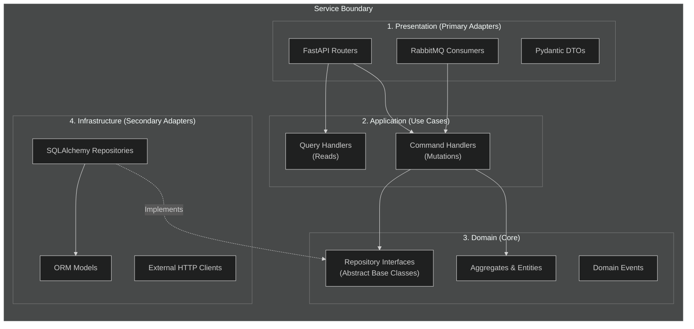

# ProductsFlow

[](https://github.com/PVMalove/ProductsFlow/actions/workflows/ci.yml)

[](LICENSE)

ProductsFlow — это распределенная микросервисная платформа для учёта товаров. Архитектура построена на принципах изолированного предметно-ориентированного проектирования (DDD), событийно-ориентированного взаимодействия (EDA) и гексагональной архитектуры (Clean Architecture).

Проект организован по принципу Polyrepo в рамках одного репозитория, что обеспечивает строгую изоляцию микросервисов друг от друга без риска "ада зависимостей".

## Макро-Архитектура

```mermaid
%%{init: {'theme': 'dark'}}%%
graph TD

    Users["Web / Mobile Clients"]
    Gateway["API Gateway<br/>(Traefik / Nginx)"]

    Users -->|HTTPS| Gateway

    subgraph APP["Backend Environment (Polyrepo Workspace)"]
    direction TB

        subgraph SERVICES["Microservices (FastAPI)"]
    direction TB
            Identity["identity-service<br/>Auth / Users / JWT"]
            Catalog["catalog-service<br/>Products / Inventory"]
            Support["support-service<br/>Tickets / Support"]
        end

        Gateway --> Identity
        Gateway --> Catalog
        Gateway --> Support

        subgraph WORKERS["Async Workers (AMQP)"]
    direction TB
            IdentityWorker["identity-worker<br/>(Outbox Relay)"]
            CatalogWorker["catalog-worker"]
            SupportWorker["support-worker"]
        end

        subgraph LIBS["Shared Packages (libs/)"]
    direction TB
            KernelDomain["kernel-domain<br/>(DDD, CQRS)"]
            KernelPlatform["kernel-platform<br/>(Outbox, AMQP)"]
        end
        
        Identity -.-> KernelDomain & KernelPlatform
        Catalog -.-> KernelDomain & KernelPlatform
        Support -.-> KernelDomain & KernelPlatform

        subgraph PLATFORM["Platform"]
    direction TB
            OTel["OpenTelemetry Collector"]
        end

        Identity --> OTel
        Catalog --> OTel
        Support --> OTel

    end

    subgraph DATA["Data and Messaging"]
    direction TB

        subgraph POSTGRES["PostgreSQL"]
    direction TB
            IdentityDB[("identity_db<br/>(Logical Schema)")]
            CatalogDB[("catalog_db<br/>(Logical Schema)")]
            SupportDB[("support_db<br/>(Logical Schema)")]
        end

        RabbitNode(("RabbitMQ (Event Bus)<br/>Broker"))

        MinIO[("MinIO (S3)<br/>Media Storage")]

    end

    Identity --->|Data & Outbox| IdentityDB
    Catalog --->|Data & Outbox| CatalogDB
    Support --->|Data & Outbox| SupportDB

    IdentityWorker -.->|Polls Outbox| IdentityDB
    CatalogWorker -.->|Polls Outbox| CatalogDB
    SupportWorker -.->|Polls Outbox| SupportDB

    IdentityWorker --->|Publish / Consume| RabbitNode
    CatalogWorker --->|Publish / Consume| RabbitNode
    SupportWorker --->|Publish / Consume| RabbitNode

    Catalog --->|Media Upload| MinIO

    subgraph OBS["Observability Stack"]
    direction TB
        Prometheus[("Prometheus")]
        Jaeger[("Jaeger / Tempo")]
        Grafana["Grafana"]
    end

    OTel --> Prometheus
    OTel --> Jaeger

    Grafana --- Prometheus
    Grafana --- Jaeger

    subgraph CICD["CI / CD (Polyrepo)"]
    direction TB
        Git["Monorepo (GitHub)"]
        CI["GH Actions<br/>(Matrix Testing)"]
        Registry["Docker Registry"]
        
        Git --> CI
        CI --> Registry
    end

    Registry --> APP

    %% Force DATA and OBS subgraphs below APP
    APP ~~~ DATA
    APP ~~~ OBS

    style Users fill:#1f2937,stroke:#9ca3af,color:#fff
    style Gateway fill:#0f766e,stroke:#2dd4bf,color:#fff
    style Identity fill:#1e3a8a,stroke:#60a5fa,color:#fff
    style Catalog fill:#1e3a8a,stroke:#60a5fa,color:#fff
    style Support fill:#1e3a8a,stroke:#60a5fa,color:#fff
    style IdentityWorker fill:#1e3a8a,stroke:#60a5fa,color:#fff
    style CatalogWorker fill:#1e3a8a,stroke:#60a5fa,color:#fff
    style SupportWorker fill:#1e3a8a,stroke:#60a5fa,color:#fff
    style KernelDomain fill:#14532d,stroke:#4ade80,color:#fff
    style KernelPlatform fill:#14532d,stroke:#4ade80,color:#fff
    style OTel fill:#4c1d95,stroke:#a78bfa,color:#fff
    style IdentityDB fill:#7c2d12,stroke:#fb923c,color:#fff
    style CatalogDB fill:#7c2d12,stroke:#fb923c,color:#fff
    style SupportDB fill:#7c2d12,stroke:#fb923c,color:#fff
    style RabbitNode fill:#7c2d12,stroke:#fb923c,color:#fff
    style MinIO fill:#7c2d12,stroke:#fb923c,color:#fff
    style Prometheus fill:#4c1d95,stroke:#a78bfa,color:#fff
    style Jaeger fill:#4c1d95,stroke:#a78bfa,color:#fff
    style Grafana fill:#4c1d95,stroke:#a78bfa,color:#fff
    style Git fill:#14532d,stroke:#4ade80,color:#fff
    style CI fill:#14532d,stroke:#4ade80,color:#fff
    style Registry fill:#14532d,stroke:#4ade80,color:#fff
```

<details>
<summary><b>Показать схему макро-архитектуры (Mermaid)</b></summary>



</details>

Система разделена на независимые микросервисы, которые общаются друг с другом асинхронно (паттерн Choreography) через брокер сообщений, а наружу отдают REST API через единый API Gateway. У каждого сервиса своя изолированная база данных (схемы в PostgreSQL) и свои зависимости:

- **`identity-service`**: Управление пользователями, ролевая модель (admin/user) и выдача Stateless JWT, подписанных закрытым ключом RS256.
- **`catalog-service`**: Управление инвентарем и профилями товаров (CRUD, деактивация, загрузка и привязка медиа).
- **`support-service`**: Система обратной связи и управления тикетами пользователей.

Общая инфраструктура и бизнес-абстракции вынесены в `libs/` (Shared Kernel):
- `kernel-domain`: Чистые доменные абстракции, не имеющие сторонних зависимостей (Aggregate Root, Domain Events, CQRS интерфейсы).
- `kernel-platform`: Инфраструктурные адаптеры (Transactional Outbox, AMQP Consumers с Dead Letter Queue, JWT Validators).
- `observability`: Настройки OpenTelemetry для сбора метрик и трейсов.

## Микро-Архитектура (Устройство сервиса)

Организация кода внутри каждого сервиса строго следует правилу инверсии зависимостей (Clean Architecture) и разделению ответственности (CQRS).



## Стек технологий

- **Python 3.14**, **FastAPI**, **Pydantic v2**
- **Микросервисы & CQRS** (изолированные слои: Router → Command/Query Handler → Domain → Repo)
- **SQLAlchemy 2.0** (async), **Alembic** (изолированные миграции БД)
- **PostgreSQL** (логически разделенные БД/схемы)
- **RabbitMQ** + **Transactional Outbox Pattern** (решение проблемы "двойной записи" и гарантия доставки доменных событий)
- **MinIO** (S3-совместимое хранилище изображений товаров)
- **Traefik / Nginx** (API Gateway)
- **OpenTelemetry** (Jaeger / Prometheus) для распределенной трассировки
- **JWT (pyjwt, RS256)** + **bcrypt** для аутентификации и быстрой локальной проверки прав без HTTP-запросов
- **uv** (строгая изоляция окружений внутри монорепозитория)
- **pytest**, **ruff**, **mypy**
- **Docker Compose** и **GitHub Actions** (матричные параллельные CI/CD пайплайны)

## Быстрый старт

Для локальной разработки используется `Full Docker` подход, при котором вся инфраструктура и все микросервисы поднимаются разом.

Требуется [uv](https://docs.astral.sh/uv/), `make` и `Docker`.

```bash
# 1. Настроить окружение
cp .env.example .env
# Отредактируйте .env при необходимости (см. раздел "Переменные окружения")

# 2. Поднять абсолютно всю инфраструктуру (Postgres, RabbitMQ, MinIO, Gateway и микросервисы)
make up
# или напрямую: docker-compose up --build -d

# 3. Применить миграции к каждому микросервису
# Миграции строго разделены; применяются изолированно через uv
make db-upgrade pkg=identity-service
make db-upgrade pkg=catalog-service
make db-upgrade pkg=support-service
```

Проверить, что API Gateway маршрутизирует трафик и всё работает, можно открыв единый Swagger UI: `http://localhost:8000/docs`.

## Тестирование

Так как проект является Polyrepo, запуск тестов осуществляется изолированно для каждого микросервиса (матричный запуск) с помощью `uv`, что радикально ускоряет CI пайплайн. 

```bash
# Запуск тестов, линтеров и тайп-чекеров для конкретного пакета/сервиса:
make test pkg=identity-service
make test pkg=catalog-service
make test pkg=kernel-domain
```

## Переменные окружения

Все переменные окружения централизованно задаются в корневом файле `.env` для удобства локального запуска всей системы.

| Переменная               | Назначение                                                                 |
| ------------------------- | --------------------------------------------------------------------------- |
| `APP_ENV`                 | Окружение приложения (`dev`/`prod`)                                         |
| `JWT_PRIVATE_KEY`         | RSA Private Key для подписи токенов (используется в `identity-service`)     |
| `JWT_PUBLIC_KEY`          | RSA Public Key для валидации (используется во всех остальных сервисах)      |
| `ACCESS_TOKEN_TTL_HOURS`   | Время жизни access-токена, часы                                             |
| `POSTGRES_USER` / `PASSWORD` | Общие креды для контейнера PostgreSQL                                   |
| `POSTGRES_PORT`           | Порт Postgres на хосте                                                      |
| `IDENTITY_DB_URL`         | Строка подключения для `identity-service`                                   |
| `CATALOG_DB_URL`          | Строка подключения для `catalog-service`                                    |
| `SUPPORT_DB_URL`          | Строка подключения для `support-service`                                    |
| `RABBITMQ_URL`            | Строка подключения к брокеру сообщений RabbitMQ                             |
| `MINIO_ROOT_USER` / `PASS`| Креды для S3-совместимого хранилища MinIO                                   |
| `OTEL_EXPORTER_ENDPOINT`  | Точка сбора метрик и логов (Jaeger)                                         |
| `API_GATEWAY_PORT`        | Публичный порт, который слушает API Gateway (обычно 8000)                   |

## API Документация

Полная интерактивная спецификация доступна в едином Swagger UI на уровне API Gateway. Все идентификаторы сущностей в системе переведены на **UUIDv4**. Ниже приведена сводка основных эндпоинтов, сгруппированная по микросервисам.

### Identity Service (Авторизация и Пользователи)

| Метод | Путь                 | Доступ       | Описание                                                  |
| ----- | --------------------- | ------------- | ----------------------------------------------------------- |
| POST  | `/auth/register`      | публичный    | Регистрация нового пользователя                             |
| POST  | `/auth/login`         | публичный    | Получение JWT access-токена                                 |
| GET   | `/users/`             | admin        | Список всех пользователей                                   |
| GET   | `/users/me`           | авторизован    | Профиль текущего пользователя                               |
| PATCH | `/users/me/password`  | авторизован    | Смена пароля                                                |
| DELETE| `/users/me`           | авторизован    | Удаление аккаунта (асинхронно генерирует `user.deleted`)    |

### Catalog Service (Товары и Инвентарь)

| Метод  | Путь                          | Доступ                | Описание                                                      |
| ------ | ------------------------------ | ----------------------- | --------------------------------------------------------------- |
| GET    | `/products/`                    | публичный (опц. auth)  | Список товаров с курсорной пагинацией                           |
| GET    | `/products/search`              | публичный (опц. auth)  | Поиск товаров (с учетом Read Models, скрывающих удаленные)      |
| GET    | `/products/{uuid}`              | публичный (опц. auth)  | Детали товара по UUID                                           |
| POST   | `/products/`                    | авторизован             | Создать новый товар (генерирует событие в Outbox)               |
| PUT    | `/products/{uuid}/image`        | владелец/admin          | Загрузка изображения (файлы сохраняются в MinIO)                |
| PATCH  | `/products/{uuid}`              | владелец/admin          | Изменить товар (CQRS Command)                                   |
| PATCH  | `/products/{uuid}/activate`     | владелец/admin          | Де/Активировать товар                                           |
| DELETE | `/products/{uuid}`              | владелец/admin          | Удалить товар безвозвратно                                      |

### Support Service (Система Тикетов)

| Метод | Путь                        | Доступ    | Описание                                               |
| ----- | ----------------------------- | ---------- | -------------------------------------------------------- |
| POST  | `/tickets/`                    | авторизован | Создать обращение в поддержку                            |
| GET   | `/tickets/me`                  | авторизован | Список моих тикетов                                      |
| GET   | `/tickets/{uuid}`              | авторизован | Просмотр тикета (анонимизируется при удалении аккаунта)  |

## Лицензия

[MIT](LICENSE)
