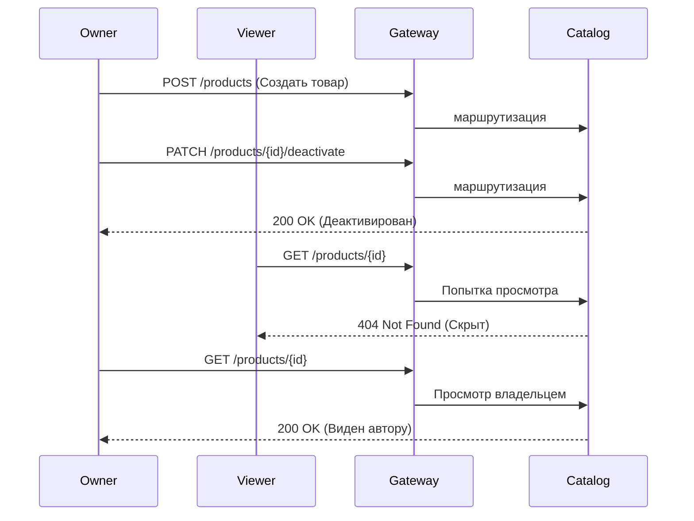
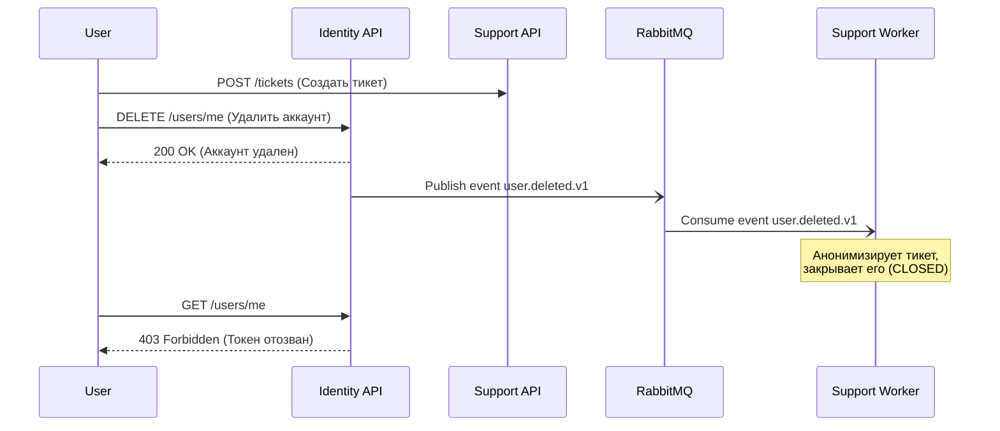

# E2E Тестирование (Black-box Pipeline)

Пайплайн сквозного (End-to-End) тестирования проверяет систему целиком, как "черный ящик", обращаясь исключительно через единый тестовый Nginx API Gateway. Внутреннее взаимодействие проверяется асинхронно через RabbitMQ, валидируя итоговую консистентность всей распределенной архитектуры.

## Запуск

Окружение запускается изолированно (`session-scoped`). Подробности инфраструктуры можно найти в [ADR 0013](../../../docs/adr/0013-testing-strategy.md).

```bash
# Из корня backend/
uv run --project tests/e2e pytest tests/e2e
```

## Реализованные сценарии

В пайплайне на данный момент реализованы 3 глобальных сценария:

### 1. Проверка доменных правил видимости (Catalog)
**Файл:** `test_inactive_product_visibility.py`

Проверяет многопользовательскую изоляцию и видимость товаров.
- Регистрируются два независимых пользователя: `Owner` и `Viewer`.
- `Owner` создает товар (публично доступен).
- `Owner` деактивирует товар (меняет статус `is_active=False`).
- **Проверка:** `Owner` по-прежнему видит свой товар (HTTP 200), а для `Viewer` этот же URL отдаёт HTTP 404 (товар скрыт от посторонних).



### 2. Защита периметра (API Gateway)
**Файл:** `test_inactive_product_visibility.py`

Гарантирует, что Nginx API Gateway выступает надежным барьером и не пропускает неавторизованные пути наружу.
- Имитируется запрос к внутренней системной ручке (например, `/internal/health`).
- Gateway обязан заблокировать запрос (HTTP 404) до того, как он дойдет до микросервисов.

### 3. Межсервисная Хореография (Identity → RabbitMQ → Support)
**Файл:** `test_user_deletion.py`

Тестирует распределенную Event-Driven архитектуру. Проверяет, что удаление пользователя в одном микросервисе корректно транслируется и обрабатывается в другом.
- Пользователь регистрируется и создает обращение (тикет) в `support-service`.
- Пользователь удаляет свой профиль (`DELETE /users/me` в `identity-service`).
- `identity-service` под капотом публикует событие `user.deleted.v1` в RabbitMQ.
- Воркер службы поддержки ловит событие, анонимизирует автора тикета (заменяя ID на `null`), переводит тикет в `CLOSED` и оставляет системное сообщение.
- Тест авторизуется под Администратором и поллит API поддержки, ожидая подтверждения, что тикет закрыт и анонимизирован.


