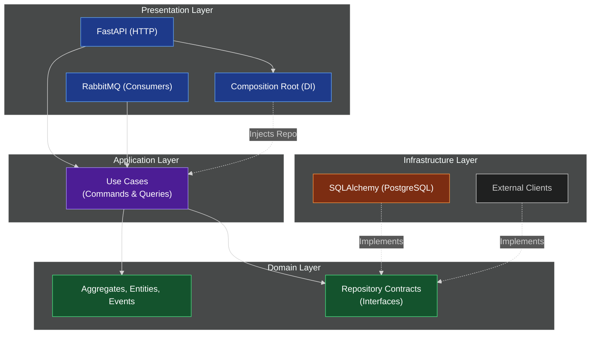

# Архитектура backend-сервисов

## Статус и область действия

Этот документ — рабочая конвенция для новых и рефакторимых сервисов в
`backend/services/`. Он дополняет решения о границах shared-кода в
[ADR 0013](adr/0013-kernel-domain-platform-split.md), изолированных пакетных
окружениях в [ADR 0020](adr/0020-per-package-environments-supersedes-0010.md)
и уточняет расположение repository-контрактов и use case в
[ADR 0027](adr/0027-domain-repository-contracts.md), а обязательное
дерево проекта — в [ADR 0026](adr/0026-canonical-fastapi-microservice-layout.md).

Референсная модель —
[FastAPI Microservice Template](https://github.com/onlythompson/fastapi-microservice-template):
она разделяет domain, application, infrastructure и presentation и направляет
зависимости внутрь. В проекте repository-контракт агрегата закреплён в domain.
Мы берём его структуру и границы, но не копируем автоматически необязательные
технологии (Kafka, Redis, gRPC, GraphQL) или их реализацию.

## Структура сервиса

```text
backend/services/<service>/              # независимо разворачиваемый сервис
  src/
    application/                         # use case, команды/запросы
    domain/                              # модель и repository-контракты bounded context
      repositories.py
      events/
    infrastructure/                      # SQLAlchemy, AMQP, HTTP/S3-адаптеры
    presentation/                        # FastAPI/AMQP-адаптеры и DI wiring
      routes/
      schemas/
      dependencies.py
      main.py
    core/                                # кросс-срезная политика сервиса
      feature_flags.py
      resilience.py
      secrets.py
      rate_limiter.py
    common/                              # локальные константы и утилиты
  tests/
    unit/
    integration/
    e2e/
    performance/
      locustfile.py
  k8s/
    deployment.yaml
    service.yaml
    ingress.yaml
  docs/
    api.md
    architecture.md
    adr/
  ci/
    Jenkinsfile
    github-actions-workflow.yml
  scripts/
    secret_rotation.sh
  .env
  .env.example
  .gitignore
  docker-compose.yml
  Dockerfile
  pyproject.toml
  README.md
  requirements.txt
```

Это целевая обязательная раскладка **каждого** сервиса, а не новый единый
пакет на уровне `backend/`. Репозиторные `docs/adr/` продолжают хранить
межсервисные решения; `<service>/docs/` хранит документы, относящиеся только к
этому сервису. До завершения миграции #163 текущие пути являются legacy и не
образуют второй архитектурный вариант.

## Направление зависимостей

Архитектура строго следует правилу инверсии зависимостей (Dependency Inversion). Вектор зависимости направлен исключительно внутрь — к `domain`-слою.



- `domain` содержит агрегаты, value objects, доменные события, политики и
  repository-контракты. Он не импортирует FastAPI, SQLAlchemy, HTTP-клиенты,
  AMQP или application.
- `application` выражает use case и оркестрирует доменную модель. Он импортирует
  domain-контракты для типизации зависимостей, но не FastAPI, SQLAlchemy или
  конкретные адаптеры.
- `infrastructure` реализует domain repository-контракты и владеет транзакцией,
  SQLAlchemy-моделями, внешними клиентами и брокером. Она может импортировать
  application и domain, но её конкретные классы не должны быть типами в
  use case.
- `presentation` преобразует HTTP/AMQP во входные данные сценария и результат
  — в HTTP/сообщение. В `presentation/dependencies.py` или равнозначной
  DI-фабрике на внешней границе допустимо создать конкретный инфраструктурный
  адаптер и вернуть его как domain repository; в самом роуте этого импорта и
  бизнес-оркестрации быть не должно.
- `core` хранит только кросс-срезную политику *одного* сервиса: feature flags,
  resilience, secrets и rate limiting. `common` — локальные константы и
  короткие утилиты. Ни один из них не заменяет `kernel-domain`/`kernel-platform`
  и не становится межсервисной свалкой.

`kernel-domain` остаётся только для действительно общих, dependency-free
доменных примитивов. Сервисные repository-контракты принадлежат domain
соответствующего bounded context и не становятся shared-примитивами без
отдельного решения.

## Use case и CQRS

Команда или запрос — данные входа use case; handler получает зависимости через
конструктор и выполняет один сценарий. Его можно тестировать напрямую, без
FastAPI и без реальной инфраструктуры.

CQRS обязателен для активного кода `backend`: write- и read-операции всегда
разделяются на command/query DTO и отдельные handlers, даже если сценарий —
простой CRUD. При этом не требуется искусственно разносить одинаковую логику
по дополнительным модулям или заводить общий `ICommand`/`IQuery`, handler
Protocol, диспетчер или глобальный реестр. FastAPI `Depends()` остаётся явной
точкой связывания входа, handler и адаптеров.

## Проверка границы

Перед PR проверьте, что:

- unit-тесты handler-ов используют фейки доменных repository-контрактов и не поднимают
  FastAPI или БД;
- integration-тесты проверяют реализацию доменного repository-контракта;
- HTTP/AMQP-тесты проверяют контракт `presentation`-адаптера и DI-wiring;
- `tests/performance/locustfile.py` фиксирует воспроизводимый вход для
  нагрузочных сценариев, а `k8s/`, `ci/` и `scripts/` принадлежат сервису;
- из `domain/` и `application/` нет импортов конкретных модулей
  `infrastructure/`, FastAPI или SQLAlchemy.

## CQRS Enforced (Миграция завершена)

Слияние пула задач #191–#195 завершило глобальный рефакторинг: паттерн CQRS **полностью внедрен и строго соблюдается** во всех активных микросервисах (`identity`, `catalog`, `support`). 

Правила разделения команд и запросов закреплены в [ADR 0028](adr/0028-cqrs-baseline-and-architecture-check.md). 
Быстрая локальная проверка, блокирующая нарушения архитектуры (выполняется как локально, так и в CI), запускается командой `make -C backend architecture-check` (которая вызывает `backend/scripts/check_architecture.py`). Фасады `*_use_cases.py` полностью удалены.

Для нового сценария сначала создаётся входной DTO (`*Command` или `*Query`) и
отдельный handler (`*CommandHandler` или `*QueryHandler`) в `application/`.
Command-handler изменяет агрегат через command-side port, возвращает результат
команды или доменное событие и завершает работу в одной транзакции с outbox.
Query-handler читает через query-side port/read model и не меняет состояние.
HTTP-адаптер только преобразует transport DTO и вызывает handler.

### Чек-лист нового сценария

Перед реализацией проверьте:

1. DTO неизменяем и не импортирует transport или infrastructure-типы.
2. Command-handler зависит от command-side port; если ему нужно загрузить
   агрегат для проверки инварианта, чтение выполняется через тот же write-side
   repository, а не через query-handler или query-port.
3. Command-side и query-side модули не импортируют друг друга. Общая логика
   выносится в domain или нейтральный application helper.
4. Query-handler зависит только от query-side port/read model и не вызывает
   mutation, outbox или domain event.
5. Для операции создан отдельный модуль в `application/commands/` или
   `application/queries/`, а публичный импорт добавлен в соответствующий
   `__init__.py`.
6. Unit-тест проверяет handler через fake порта; integration-тест проверяет
   adapter и сохранение публичного transport/event contract.
7. Перед PR запущены `make -C backend architecture-check`, package check и
   package tests.

Compatibility adapter допустим только для сохранения существующего import
contract, должен быть command-only или query-only re-export без бизнес-логики и
явно помечен docstring. Смешанные `*_use_cases.py` фасады запрещены.
