# Архитектура backend-приложения

## Статус и область действия

Этот документ — описательный компаньон к [ADR-базе](../adr/README.md), а не источник решений: он объясняет и иллюстрирует диаграммами то, что уже зафиксировано в ADR, но не заменяет и не дополняет их. При расхождении между этим документом и конкретным ADR побеждает ADR — актуализируйте здесь.

Основные ссылки: топология и границы контекстов — [ADR 0001](../adr/0001-platform-topology-and-bounded-contexts.md); внутренняя структура сервиса, CQRS, Unit of Work — [ADR 0006](../adr/0006-service-internal-architecture-baseline.md); доменные модели сервисов — [ADR 0007](../adr/0007-identity-service-domain-model.md)–[0009](../adr/0009-support-service-domain-model.md); событийная интеграция — [ADR 0010](../adr/0010-identity-service-event-integration.md)–[0012](../adr/0012-support-service-event-integration.md); BFF-конверт и обработка ошибок — [ADR 0002](../adr/0002-bff-response-envelope.md)/[0003](../adr/0003-centralized-error-handling.md); безопасность — [ADR 0005](../adr/0005-security-auth-actor-contract.md).

Архитектура базируется на принципах предметно-ориентированного проектирования (DDD), событийно-ориентированного взаимодействия (EDA) и гексагональной архитектуры (Ports & Adapters). Референсная модель структуры сервиса — [FastAPI Microservice Template](https://github.com/onlythompson/fastapi-microservice-template): мы берём её разделение на слои и направление зависимостей внутрь, но не копируем автоматически её необязательные технологии (Kafka, Redis, gRPC, GraphQL) — в проекте их нет. Схемы оптимизированы для тёмной темы.

---

## 1. Глоссарий

- **Polyrepo (в рамках Monorepo).** Независимые сервисы лежат в одном репозитории; каждый пакет объявляет свои зависимости в собственном `pyproject.toml`. Резолвятся они, однако, в один общий `backend/uv.lock`/`backend/.venv` (`[tool.uv.workspace]` в `backend/pyproject.toml`) — см. ниже, раздел 2.
- **DDD (Domain-Driven Design).** Проектирование, отталкивающееся от бизнес-процессов; бизнес-логика ядра не зависит от фреймворков и баз данных.
- **Clean / Hexagonal Architecture (Ports & Adapters).** Разделение на слои, где зависимости направлены исключительно внутрь (к Domain). Внешние системы (БД, брокер, HTTP-клиенты) общаются с ядром через заданные интерфейсы (порты).
- **Aggregate / Entity.** Сущность, инкапсулирующая бизнес-инварианты; создаётся только через фабричный метод (`create`), не напрямую через конструктор ([ADR 0006](../adr/0006-service-internal-architecture-baseline.md)).
- **Outbox Pattern.** Решение проблемы "двойной записи" (dual write): доменные события сохраняются в таблицу `outbox_messages` в одной транзакции с бизнес-данными явным вызовом `drain_events_to_outbox()`, а фоновый воркер асинхронно доставляет их в брокер ([ADR 0010](../adr/0010-identity-service-event-integration.md)).
- **Идемпотентность.** Способность обработчика событий безопасно принимать одно и то же сообщение несколько раз без дублирования эффектов — необходимо из-за гарантии доставки At-Least-Once в RabbitMQ.
- **API Gateway.** В этом проекте — **не production-компонент**. Nginx-Gateway существует только как изолированная E2E-тестовая инфраструктура, поднимаемая и уничтожаемая pytest-фикстурой на время прогона; клиенты в dev/prod обращаются к каждому сервису напрямую по его собственному host-порту ([ADR 0001](../adr/0001-platform-topology-and-bounded-contexts.md), [ADR 0004](../adr/0004-api-gateway-and-routing.md)).

---

## 2. Топология workspace-репозитория

```text
backend/
├── Makefile                     # Task runner: pkg=<lib|service> для сборки/тестов, service=<compose-service> для образов/стека
├── pyproject.toml               # Общий [tool.ruff]/[tool.mypy]-конфиг + [tool.uv.workspace] (members = libs/*, services/*) → один backend/uv.lock
├── docker-compose.yml           # База: *-db, *-bootstrap, *-api, *-worker, minio, rabbitmq
├── docker-compose.dev.yml       # Override: host-порты 9010–9012, APP_ENV=dev
├── docker-compose.prod.yml      # Override: host-порты 9013–9015, APP_ENV=prod, restart: unless-stopped
├── docker-compose.e2e.yml       # Override: Nginx Gateway, только для E2E-фикстуры (не для dev/prod)
├── tests/e2e/                   # Межсервисные black-box сценарии + nginx.conf Gateway'я
│
├── libs/                        # Shared Kernel — path-зависимости, HEAD, без semver
│   ├── kernel-domain/            # Только stdlib: Result/Error, Entity, DomainEvent, VisibilityPolicy
│   ├── kernel-platform/          # FastAPI/httpx/SQLAlchemy/OTEL: HTTP-конверт, Actor, IdentityClient, Outbox/UnitOfWork, pagination
│   ├── observability/            # Structured logging, RequestContextMiddleware — выделен из kernel-platform
│   └── test-support/             # Dev-only: testcontainers-фикстуры, FakeUnitOfWork
│
└── services/                    # Независимые микросервисы, каждый — свой pyproject.toml, свой Dockerfile
    ├── identity-service/         # Аутентификация, User, единственный producer событий
    ├── catalog-service/          # Товары, картинки, OwnerReadModel
    └── support-service/          # Тикеты, user_projection
```

Никакого `infra/` или общего `gateway/`-каталога на уровне `backend/` нет — все compose-файлы лежат в корне `backend/`, а Nginx для E2E — в `backend/tests/e2e/`.

**Окружение — общий workspace-lock, не изоляция по пакету.** Каждый пакет (`libs/*`, `services/*`) объявляет свои зависимости и `[dependency-groups] dev` в собственном `pyproject.toml`, но резолвятся они в один `backend/uv.lock`/`backend/.venv` — отдельных `uv.lock` внутри `libs/*`/`services/*` нет. Это реинтегрированный workspace (`[tool.uv.workspace] members = ["libs/*", "services/*"]` в `backend/pyproject.toml`), понадобившийся для `backend/tests/e2e/` — межсервисного набора тестов, не принадлежащего ни одному пакету и которому нужно одно связное окружение (`httpx`, `pytest`, `pytest-asyncio`). `make check`/`test`/`format pkg=<member>` делают `cd libs/<member>|services/<member> && uv sync --all-packages` — `cd` только выбирает, какой пакет линтуется/тестируется, а не какое окружение резолвится: оно всегда одно на весь `backend/`. Editable path-зависимость на kernel-пакеты — в dev; `--no-editable` — в production-образе каждого сервиса (у Dockerfile своя, изолированная сборка). Ломающее изменение в любом kernel-пакете красит CI-матрицу у всех потребителей сразу — это и есть защитный механизм вместо версионирования kernel semver'ом.

**Раскладка одного сервиса** ([ADR 0006](../adr/0006-service-internal-architecture-baseline.md)):

```text
backend/services/<service>/
  src/
    domain/           # entities/, value_objects/, events/, repositories.py, unit_of_work.py
    application/      # commands/, queries/, ports/
    infrastructure/   # db/, security/ — реализации портов
    api/              # FastAPI-роутеры, HTTP-схемы, composition root
    contracts/        # framework-independent View (frozen dataclasses) для BFF-ответов
    core/             # кросс-срезная политика сервиса
    common/           # локальные утилиты
  tests/
    unit/  integration/  e2e/  performance/
  k8s/  docs/  ci/  scripts/
```

`api/` — текущее и фактическое имя presentation-слоя во всех трёх сервисах; переименование в `presentation/` целится как будущий шаг, но не выполнено ни в одном сервисе — не путать целевое имя с фактическим.

---

## 3. Макро-архитектура (межсервисное взаимодействие)

Сервисы **не имеют общих баз данных** и не импортируют код друг друга. Клиент обращается к каждому сервису напрямую (нет production Gateway, см. глоссарий); синхронные межсервисные вызовы сведены к двум узким точкам в catalog ([ADR 0011](../adr/0011-catalog-service-event-integration.md)).

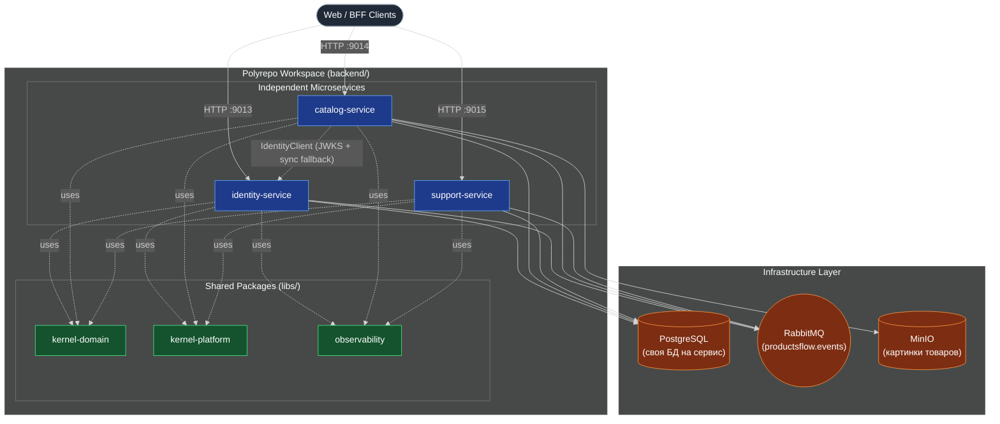

`support-service` не изображён со стрелкой к identity: он не делает синхронных HTTP-вызовов к identity вовсе (deny-by-default, [ADR 0012](../adr/0012-support-service-event-integration.md)) — единственный канал его зависимости от identity — доставка событий через RabbitMQ.

---

## 4. Микро-архитектура (устройство отдельного сервиса)

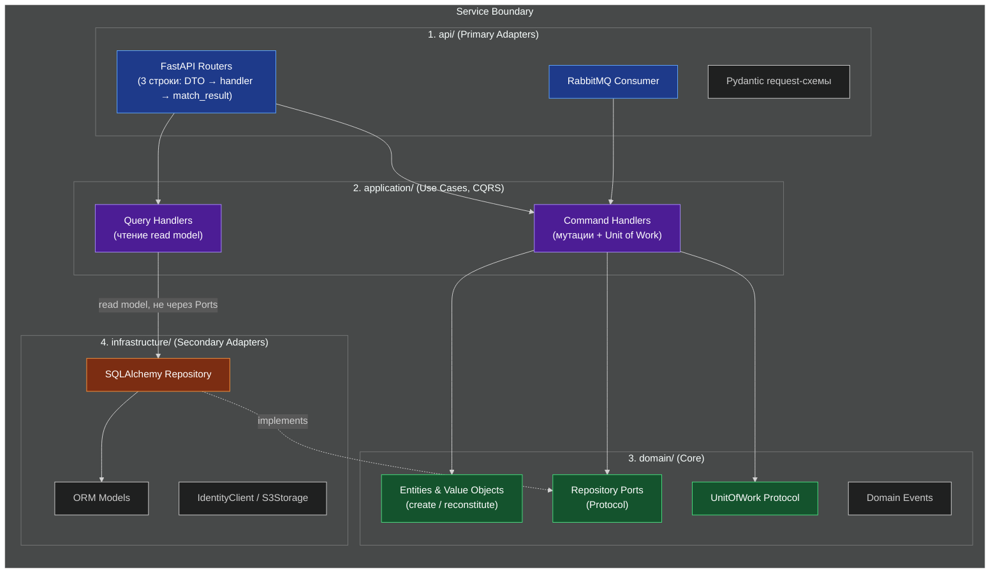

Направление зависимостей — `api → application → domain`; `infrastructure` реализует порты `domain`/`application`. Это проверяется автоматически `python backend/scripts/check_architecture.py --strict` (тот же gate — `make -C backend architecture-check`, и в CI), а не только код-ревью.

### Доменная модель: базовые абстракции и события

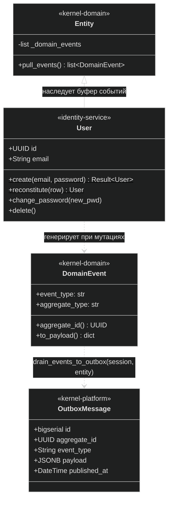

`kernel-platform` не содержит SQLAlchemy-миксина, автоматически перехватывающего мутации ORM-модели: `drain_events_to_outbox(session, entity)` — explicit-вызов в точке мутации repository-метода (`save()`/`delete()`), не автоматический сбор из `session.new`/`session.dirty` ([ADR 0006](../adr/0006-service-internal-architecture-baseline.md), [ADR 0010](../adr/0010-identity-service-event-integration.md)).

---

## 5. Потоки данных

### 5.1. Проверка JWT — расходится по сервисам

`identity-service` подписывает токены RS256 и публикует `GET /.well-known/jwks.json`. Дальше механизм проверки **не одинаков** для двух других сервисов ([ADR 0005](../adr/0005-security-auth-actor-contract.md)):

```mermaid
%%{init: {'theme': 'dark'}}%%
sequenceDiagram
    autonumber
    actor C as Client
    participant IS as identity-service
    participant CS as catalog-service
    participant SS as support-service

    C->>IS: POST /api/v1/auth/login
    IS-->>C: 200 {"access_token": "...", ...} (RS256, kid=thumbprint)

    rect rgb(20, 83, 45)
        note over CS: JWKS-кэш (IdentityClient), TTL 10 мин
        C->>CS: GET /api/v1/products/my (Bearer JWT)
        CS->>IS: GET /.well-known/jwks.json (только на промах кэша/kid)
        IS-->>CS: JWKS
        CS-->>C: 200 {"data": [...], "meta": {}}
    end

    rect rgb(124, 45, 18)
        note over SS: Статический публичный ключ из своей конфигурации
        C->>SS: GET /api/v1/tickets (Bearer JWT)
        note right of SS: Проверка подписи локально, без сети к identity
        SS-->>C: 200 {"data": [...], "meta": {}}
    end
```

`catalog-service` дополнительно делает синхронный вызов `IdentityClient.fetch_current_user()` на холодном старте read-модели и на админской ветке; `support-service` не делает ни одного синхронного вызова к identity — deny-by-default вместо этого ([ADR 0011](../adr/0011-catalog-service-event-integration.md), [ADR 0012](../adr/0012-support-service-event-integration.md)).

### 5.2. Публикация событий (Transactional Outbox)

Гарантирует, что система не окажется в неконсистентном состоянии, если после записи в БД RabbitMQ временно недоступен ([ADR 0010](../adr/0010-identity-service-event-integration.md)).

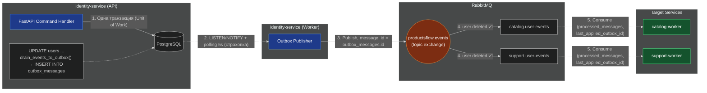

---

## 6. DevOps и CI/CD

### 6.1. Изолированные миграции БД (Alembic)

Каждому сервису — своя база и своя таблица `alembic_version`; никакой сервис не мигрирует другой.

```mermaid
%%{init: {'theme': 'dark'}}%%
sequenceDiagram
    autonumber
    actor Dev as Developer
    participant Make as backend/Makefile
    participant UV as uv (изолированное окружение пакета)
    participant AL as Alembic (контекст сервиса)
    participant DB as PostgreSQL

    Dev->>Make: make db-upgrade pkg=catalog-service

    rect rgb(30, 58, 138)
        Make->>UV: cd services/catalog-service && uv run alembic upgrade head
    end

    rect rgb(20, 83, 45)
        AL->>DB: SELECT version_num FROM alembic_version
        DB-->>AL: текущая ревизия
        AL->>DB: применение непримененных ревизий
        AL->>DB: UPDATE alembic_version
    end

    AL-->>Dev: миграции применены
```

В production/dev-профилях миграции не выполняются внутри `lifespan` FastAPI — они идут через one-off `*-bootstrap`-сервисы Compose, до старта `*-api`/`*-worker` ([ADR 0001](../adr/0001-platform-topology-and-bounded-contexts.md), раздел «Безопасный старт»).

### 6.2. CI/CD: матричное тестирование

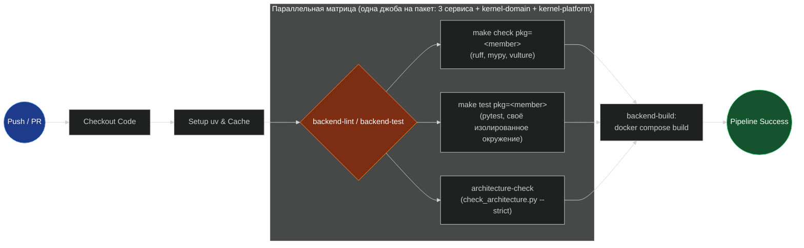

---

## 7. Прикладные паттерны

### 7.1. CQRS и тонкие роутеры

Разделение команд и запросов **обязательно** для активного кода `backend` и закреплено в [ADR 0006](../adr/0006-service-internal-architecture-baseline.md); соблюдение проверяется `check_architecture.py`, который блокирует смешанные command/query-модули и нарушения направления зависимостей.

`kernel-domain` **не** определяет общий `ICommand`/`IQuery`/handler-интерфейс, dispatcher или реестр — такая инфраструктура сознательно отклонена как избыточная для трёх сервисов с небольшим числом сценариев каждый. Command/query — локальное соглашение о форме DTO внутри `application/commands/`|`application/queries/` каждого сервиса.

Роутеры в `api/` — три строки: собрать command/query из зависимости, вызвать handler, вернуть `match_result`/`match_created`. Repository-порты (`UserRepository`, `ProductRepository`, `TicketRepository`) — `Protocol` в `domain/repositories.py` каждого сервиса.

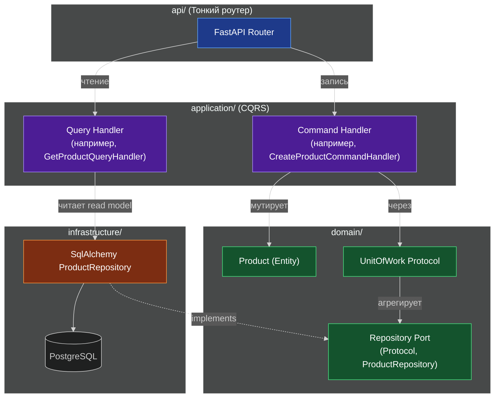

### 7.2. Идентификаторы агрегатов — GUID

Все PK агрегатов — `uuid.UUID` (Postgres `UUID`), без исключений ([ADR 0006](../adr/0006-service-internal-architecture-baseline.md)):

| Сущность | Тип ключа | Обоснование |
|---|---|---|
| `User.id` | `UUID` | Единый формат для событий и внешних ссылок между сервисами |
| `Product.id` | `UUID` | Скрытие бизнес-метрик (объём продаж), защита от IDOR |
| `OutboxMessage.aggregate_id` | `UUID` | Один тип поля для любого агрегата-источника события |

### 7.3. Картинка товара: presigned URL, не публичный бакет

`catalog-service` хранит не более одной картинки на товар в MinIO ([ADR 0008](../adr/0008-catalog-service-domain-model.md)). Бакет — **приватный**; клиент получает временную подписанную ссылку, не прямой публичный URL объекта.

```mermaid
%%{init: {'theme': 'dark'}}%%
sequenceDiagram
    autonumber
    actor C as Client
    participant API as catalog-service (Command Handler)
    participant S3 as MinIO (приватный bucket)
    participant DB as PostgreSQL

    C->>API: POST /api/v1/products/{id}/image (файл)

    rect rgb(30, 58, 138)
        API->>S3: PutObject(key="products/{id}/image") — стабильный ключ, перезаписывается при замене
        S3-->>API: 200 OK
    end

    rect rgb(20, 83, 45)
        note over API,DB: Unit of Work: upsert ProductImage + явный audit + drain_events_to_outbox
        API->>DB: INSERT ... ON CONFLICT (product_id) DO UPDATE
        API->>DB: INSERT ProductAuditLog(IMAGE_UPDATED) — в обход ORM-событий
        API->>DB: INSERT OutboxMessage(ProductImageUpdated)
    end

    API->>S3: generate_presigned_url(key)
    API-->>C: 200 {"data": {"url": "https://minio/...&Signature=..."}, "meta": {}}
```

### 7.4. Тикеты (support-service)

Жизненный цикл `Ticket`: `OPEN` → `IN_PROGRESS` → `RESOLVED` → `CLOSED` ([ADR 0009](../adr/0009-support-service-domain-model.md)). `CLOSED` — терминальный статус: обычная переписка и переходы статуса недоступны; в него автоматически переходит любой активный тикет при удалении его автора (см. 8.2). Мутации тикета/сообщения переводятся в `outbox_messages` явным вызовом в `SqlTicketRepository`, собственным, не через общий `drain_events_to_outbox` ([ADR 0009](../adr/0009-support-service-domain-model.md)).

---

## 8. Shared Kernel и хореография

### 8.1. Разделяемые библиотеки (`libs/`)

Пакеты в `libs/` подключаются в сервисы как path-зависимости `uv` (editable в dev, `--no-editable` в production-образе). Admission-правило: элемент попадает в kernel, только когда минимум два сервиса **подтверждённо** нуждаются в нём (принятым решением или фактом использования в коде) — не «понадобится потом».

1. **`kernel-domain`** — без сторонних зависимостей (только stdlib). Здесь — чистые Python-абстракции:
   - `Result`/`Error`/`ErrorType` — замена исключениям для бизнес-правил.
   - `Entity` (буфер доменных событий, `pull_events()`) и `DomainEvent` (контракт `aggregate_id()`/`to_payload()`).
   - `VisibilityPolicy` — форма политики видимости (протокол), не готовая реализация.
2. **`kernel-platform`** — зависит от FastAPI/httpx/SQLAlchemy/OTEL. Инкапсулирует инфраструктурную сложность:
   - `http` — BFF-конверт, `match_result`/`match_created`, глобальные exception handlers ([ADR 0002](../adr/0002-bff-response-envelope.md), [ADR 0003](../adr/0003-centralized-error-handling.md)).
   - `security` — `Actor`/`ActorRole`, `IdentityClient` (JWKS-кэш + `fetch_current_user`) ([ADR 0005](../adr/0005-security-auth-actor-contract.md)).
   - `outbox` — `OutboxMessage`, `drain_events_to_outbox()`, generic `UnitOfWork` Protocol ([ADR 0006](../adr/0006-service-internal-architecture-baseline.md), [ADR 0010](../adr/0010-identity-service-event-integration.md)).
   - `pagination` — общий keyset-контракт (`Cursor`, `PageInfo`, `encode_cursor`/`decode_cursor`).
3. **`observability`** — выделен из `kernel-platform`: `RequestContextMiddleware`, JSON/цветной форматтер логов, `actor_id_var`/`request_id_var`.

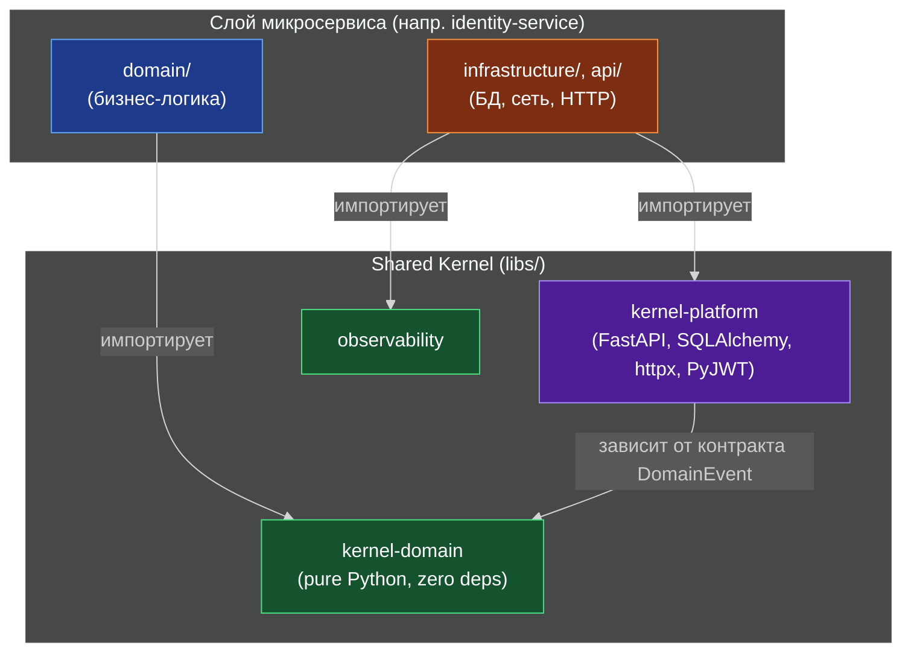

### 8.2. Межсервисная хореография

Сервисы общаются между собой асинхронно через доменные события — паттерн Choreography, без центрального оркестратора. Самый показательный сквозной поток — удаление пользователя ([ADR 0007](../adr/0007-identity-service-domain-model.md), [ADR 0010](../adr/0010-identity-service-event-integration.md)–[0012](../adr/0012-support-service-event-integration.md)):

```mermaid
%%{init: {'theme': 'dark'}}%%
sequenceDiagram
    autonumber
    actor C as Client (User)
    participant IS as identity-service
    participant MQ as RabbitMQ (productsflow.events)
    participant CS as catalog-worker
    participant SS as support-worker

    C->>IS: DELETE /api/v1/users/me

    rect rgb(30, 58, 138)
        note over IS: Unit of Work (одна транзакция)
        IS->>IS: User → анонимизированное надгробие (is_deleted=True)
        IS->>IS: drain_events_to_outbox() → INSERT OutboxMessage(user.deleted.v1)
    end

    IS-->>C: 200 {"data": null, "meta": {}}

    note over IS,MQ: Outbox Publisher асинхронно вычитывает БД (LISTEN/NOTIFY + poll)
    IS->>MQ: Publish routing key "user.deleted.v1"

    par Fan-out (topic exchange, wildcard-биндинг user.*.v1)
        MQ-->>CS: catalog.user-events
        MQ-->>SS: support.user-events
    end

    rect rgb(20, 83, 45)
        note over CS: OwnerReadModel — upsert с last_applied_outbox_id
        CS->>CS: Скрытие товаров этого владельца из выдачи
    end

    rect rgb(124, 45, 18)
        note over SS: user_projection.deleted = True (tombstone)
        SS->>SS: Анонимизация Тикетов и Сообщений
        SS->>SS: Активные Тикеты → CLOSED + системное сообщение
    end
```

Если `catalog-worker`/`support-worker` в момент удаления недоступен, событие остаётся в очереди RabbitMQ (quorum, с retry-лестницей и DLQ, [ADR 0010](../adr/0010-identity-service-event-integration.md)) — как только воркер поднимется, он прочитает событие и применит эффект. Eventual consistency без риска каскадного отказа, ценой окна рассинхронизации в секунды.

---

## 9. Unit of Work

Транзакционная граница command handler'а — `UnitOfWork` Protocol в `kernel-platform`, расширяемый каждым сервисом собственным набором репозиториев ([ADR 0006](../adr/0006-service-internal-architecture-baseline.md)).

### 9.1. Классовая структура

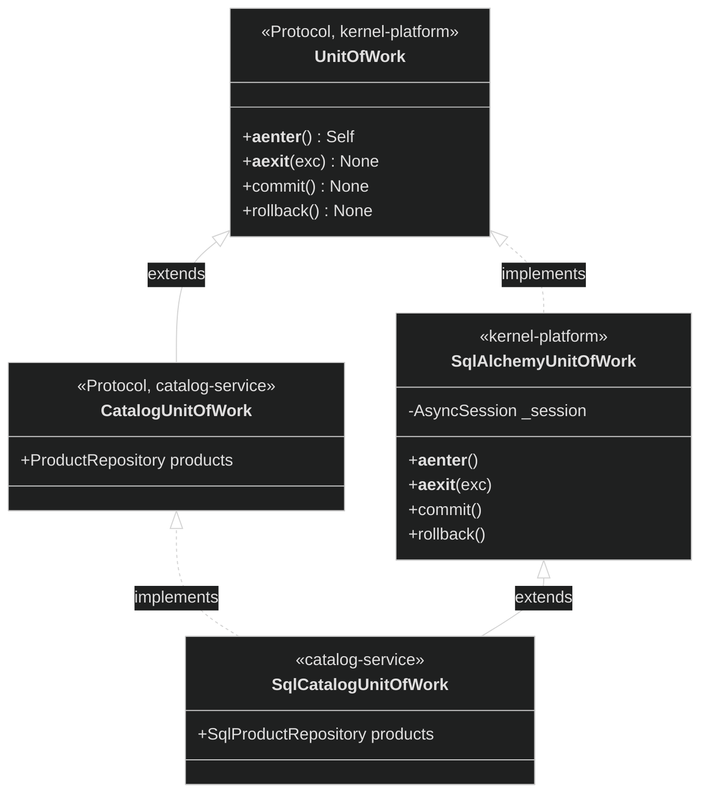

### 9.2. Жизненный цикл в Command Handler

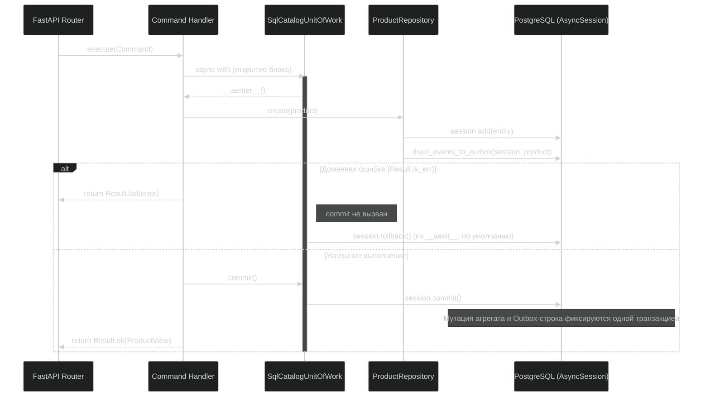

Rollback — поведение по умолчанию: если `commit()` не вызван явно на успешном пути, транзакция откатывается при выходе из `async with`. Repository-методы не вызывают `session.commit()` самостоятельно.
