# Детализированная Архитектура Backend-приложения

Данный документ описывает устройство микросервисного бэкенда (`backend/`). Архитектура базируется на принципах изолированного предметно-ориентированного проектирования (DDD), событийно-ориентированного взаимодействия (EDA) и гексагональной архитектуры. Схемы оптимизированы для **тёмной темы**.

---

## 1. Глоссарий и Базовые Концепции

*   **Polyrepo (в рамках Monorepo):** Архитектурный подход, при котором независимые сервисы лежат в одном репозитории, но имеют строго изолированные виртуальные окружения (через `uv`) и файлы блокировок (`uv.lock`). Исключает "ад зависимостей".
*   **DDD (Domain-Driven Design):** Проектирование, отталкивающееся от бизнес-процессов. Бизнес-логика ядра не зависит от фреймворков и баз данных.
*   **Clean / Hexagonal Architecture (Ports and Adapters):** Разделение на слои, где зависимости направлены исключительно внутрь (к Domain). Внешние системы (БД, API, RabbitMQ) общаются с ядром через строго заданные интерфейсы (Порты).
*   **Aggregate Root:** Главная сущность кластера связанных объектов. Мутации внутри кластера происходят только через неё, обеспечивая транзакционную целостность.
*   **Outbox Pattern:** Решение проблемы "двойной записи" (Dual Write). Доменные события сохраняются в таблицу БД в одной транзакции с бизнес-данными, а фоновый воркер (Relay) гарантированно отправляет их в брокер.
*   **Идемпотентность:** Способность обработчика событий безопасно принимать одно и то же сообщение несколько раз без дублирования эффектов (необходимо из-за гарантии доставки At-Least-Once в RabbitMQ).
*   **API Gateway:** Единая точка входа для клиентов. Занимается маршрутизацией HTTP-запросов, SSL-терминацией и ограничением частоты запросов (Rate Limiting).

---

## 2. Топология Workspace-репозитория

```text
backend/
├── Makefile                     # Единый Task Runner (маршрутизация команд в нужные пакеты)
├── pyproject.toml               # Глобальные настройки линтеров (ruff, mypy, pytest)
│
├── infra/                       # Инфраструктура
│   ├── docker-compose.yml       # Локальный стенд (Postgres, RabbitMQ, Redis)
│   └── gateway/                 # Конфигурация API Gateway (nginx / traefik / envoy)
│
├── libs/                        # Shared Kernel (Общие контракты и инструменты)
│   ├── kernel-domain/           # Базовые абстракции (Entity, AggregateRoot, DomainEvent)
│   ├── kernel-platform/         # Инфра-адаптеры (Outbox, JWT Validators, AMQP Consumers)
│   └── observability/           # Настройка OpenTelemetry (Трейсы, Метрики, Логи)
│
└── services/                    # Независимые микросервисы
    ├── identity-service/        
    │   ├── alembic/             # Изолированные миграции
    │   ├── src/identity/        # Исходный код (по слоям Clean Arch)
    │   └── pyproject.toml       # Локальные зависимости сервиса
    ├── catalog-service/         # Управление товарами/инвентарем
    └── support-service/         # Система тикетов и обратной связи
```

---

## 3. Макро-Архитектура (Межсервисное взаимодействие)

Сервисы **не имеют общих баз данных** и не импортируют код друг друга. Внешние клиенты общаются с системой через API Gateway. Синхронные межсервисные вызовы сведены к минимуму во избежание каскадных сбоев.
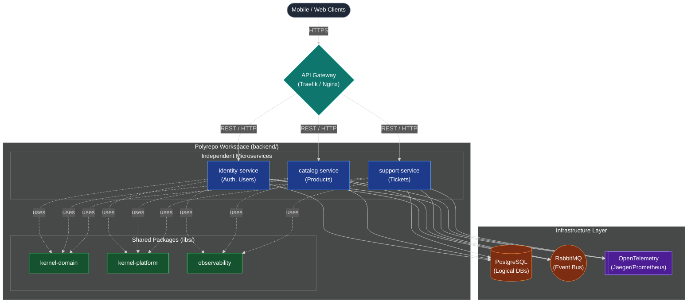

---
## 4. Микро-Архитектура (Устройство отдельного сервиса)

Организация кода внутри сервиса (например, `identity-service`) строго следует правилу инверсии зависимостей. 
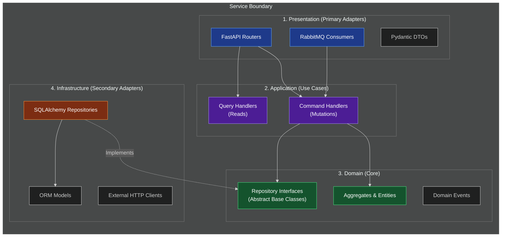

### Доменная модель и Наследование
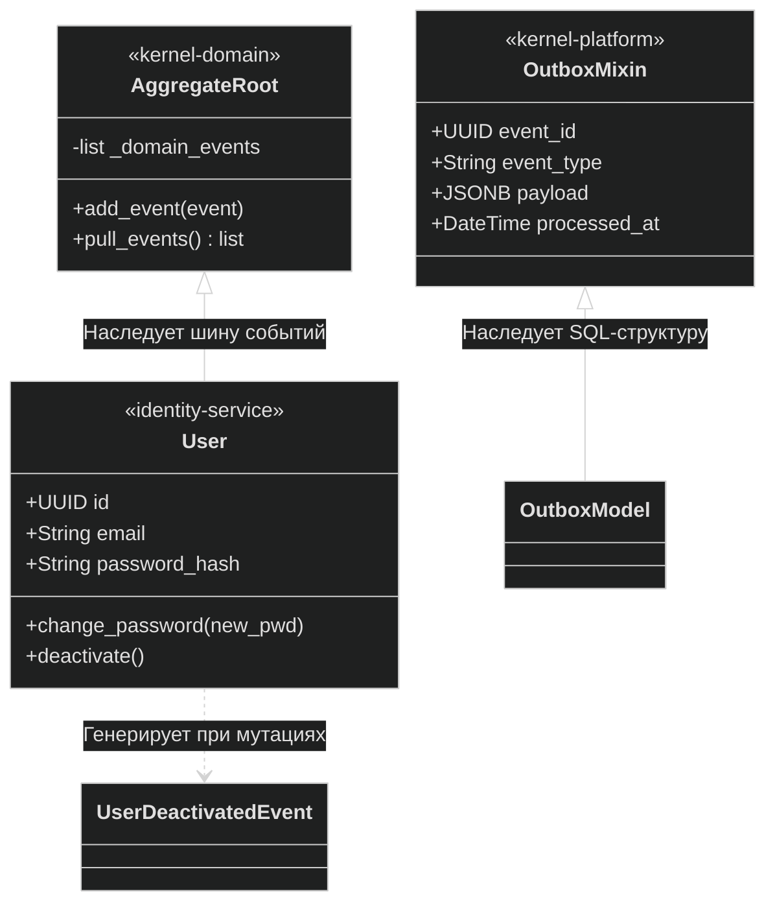

---

## 5. Потоки Данных (Взаимодействие)

### 5.1. Stateless JWT Авторизация (Локальная проверка)

При проверке прав доступа микросервисам не нужно делать HTTP-запрос в `identity-service`. Они используют публичный ключ для криптографической валидации подписи.
```mermaid
%%{init: {'theme': 'dark'}}%%
sequenceDiagram
    autonumber
    actor C as Client
    participant GW as API Gateway
    participant IS as identity-service
    participant CS as catalog-service
    participant KP as kernel-platform (Security)
    
    C->>GW: POST /auth/login
    GW->>IS: Проксирование запроса
    rect rgb(30, 58, 138)
        IS-->>C: 200 OK + JWT (Подписан RS256 Private Key)
    end
    
    C->>GW: GET /catalog/my-products (Bearer JWT)
    GW->>CS: Проксирование запроса
    
    rect rgb(20, 83, 45)
        note over CS,KP: Быстрая локальная валидация (без сети)
        CS->>KP: validate_token(JWT, RS256 Public Key)
        KP-->>CS: Payload (user_id, permissions)
    end
    CS-->>C: 200 OK (Данные каталога)
```

### 5.2. Публикация событий (Transactional Outbox)

Гарантирует, что система не окажется в неконсистентном состоянии, если после записи в БД RabbitMQ будет временно недоступен.
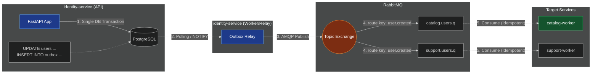

---
## 6. DevOps и CI/CD

### 6.1. Изолированные миграции БД (Alembic)

Несмотря на Polyrepo, работа с БД прозрачна для разработчика. Каждому сервису выделена своя схема/база и своя таблица `alembic_version`.
```mermaid
%%{init: {'theme': 'dark'}}%%
sequenceDiagram
    autonumber
    actor Dev as Developer
    participant Make as Root Makefile
    participant UV as uv (Virtual Env)
    participant AL as Alembic (Service Context)
    participant DB as PostgreSQL
    
    Dev->>Make: make db-upgrade pkg=identity-service
    
    rect rgb(30, 58, 138)
        Make->>UV: cd services/identity-service && uv sync
        UV-->>Make: Изолированные зависимости готовы
        Make->>AL: uv run alembic upgrade head
    end
    
    rect rgb(20, 83, 45)
        AL->>DB: SELECT version_num FROM alembic_version
        DB-->>AL: Current version: 1234a
        AL->>DB: Применение новых SQL-миграций
        AL->>DB: UPDATE alembic_version SET version_num='5678b'
    end
    
    AL-->>Dev: Миграции успешно применены
```

### 6.2. CI/CD: Матричное тестирование (GitHub Actions)

В монорепозитории тестируется и собирается только то, что изменилось. Матричная сборка запускает проверки параллельно, радикально ускоряя пайплайн.
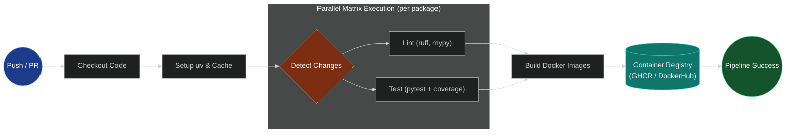

---
## 7. Продвинутые архитектурные паттерны (CQRS, S3, UUID)

В рамках непрерывного развития платформы (согласно **ADR 0023** и **ADR 0024**), архитектура системы включает в себя ряд продвинутых паттернов. Ниже описаны ключевые реализованные концепции.

### 7.1. CQRS и Тонкие контроллеры (ADR 0023)

Для строгого разделения операций чтения и записи во всех микросервисах (`identity`, `catalog`, `support`) внедрен паттерн **CQRS** (Command Query Responsibility Segregation). Следование этому паттерну **жестко контролируется** автоматизированными архитектурными тестами (`check_architecture.py`).

В разделяемой библиотеке `kernel-domain` реализованы базовые абстракции `ICommandHandler` и `IQueryHandler`. Маршрутизаторы (Routers) в `api/v1/` стали максимально тонкими: они лишь валидируют HTTP-запрос через Pydantic и передают DTO в соответствующий Handler. 

Кроме того, интерфейсы-порты репозиториев (например, `UserRepository`, `ProductRepository`, `TicketRepository`) перенесены строго в **Domain-слой**, обеспечивая идеальную инверсию зависимостей (Clean Architecture).
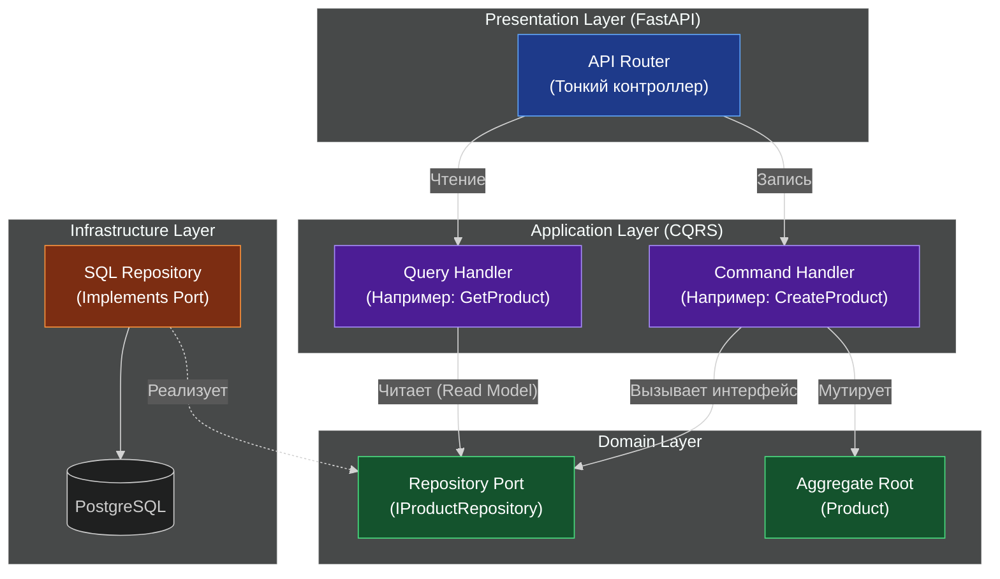

### 7.2. Миграция на UUID (ADR 0024)

Для обеспечения безопасности (защита от перебора/IDOR) и возможности распределенной генерации ключей без блокировок БД, система полностью отказалась от автоинкрементных целочисленных ключей (`int` / `BigInteger`) в пользу **UUIDv4**.

| Модель / Таблица | Старый тип ключа | Текущий тип (Реализовано) | Архитектурное обоснование |
| :--- | :--- | :--- | :--- |
| `Product.id` | `Integer` (Serial) | **`UUID`** | Скрытие объемов продаж бизнеса от конкурентов, предотвращение IDOR. |
| `OutboxMessage.aggregate_id` | `BigInteger` | **`UUID`** | Универсальность полиморфной связи для абсолютно любых доменных сущностей в системе. |
| `User.id` | `UUID` | **`UUID`** | Стандартизация. Внешние ключи между сервисами теперь используют единый формат. |

### 7.3. Медиа-хранилище (MinIO) и Синхронизация Read Models

`catalog-service` полностью реализует хранение изображений товаров через S3-совместимое хранилище (**MinIO**). 
Параллельно RabbitMQ-воркеры обеспечивают консистентность данных: при получении события об удалении/деактивации пользователя из `identity-service`, воркер каталога асинхронно обновляет `owner_read_model`, моментально скрывая товары этого пользователя из поисковой выдачи.
```mermaid
%%{init: {'theme': 'dark'}}%%
sequenceDiagram
    autonumber
    actor C as Client
    participant API as Catalog API (FastAPI)
    participant S3 as MinIO (S3 Bucket)
    participant DB as PostgreSQL
    
    C->>API: PUT /products/{id}/image (File Upload)
    
    rect rgb(30, 58, 138)
        API->>S3: PutObject(bucket="products", key="{uuid}.jpg")
        S3-->>API: 200 OK (ETag, Object URL)
    end
    
    rect rgb(20, 83, 45)
        note over API,DB: CQRS Command Handler
        API->>DB: INSERT/UPDATE ProductImage (S3 URL)
        API->>DB: INSERT OutboxEvent (ProductImageUpdated)
    end
    
    API-->>C: 200 OK (Обновленный профиль товара)
```

### 7.4. Реализация системы тикетов (Support-Service)

В рамках завершения миграции функционала реализован микросервис `support-service`. 
Сервис полностью спроектирован на базе CQRS-конвенции и управляет жизненным циклом обращений пользователей (создание тикетов, отправка сообщений, управление статусами: `OPEN` -> `IN_PROGRESS` -> `RESOLVED`). Все мутации состояния тикетов гарантированно порождают доменные события через инфраструктурный `OutboxMixin`.

---

## 8. Глубокое погружение: Shared Kernel и Хореография микросервисов

### 8.1. Устройство разделяемых библиотек (`libs/`)

В распределенной системе критически важно не дублировать сложный инфраструктурный код, но при этом не создать "распределенный монолит". Пакеты в `libs/` подключаются в изолированные сервисы как локальные зависимости через `uv` (например, `uv add ../../libs/kernel-domain`).

1. **`kernel-domain` (Чистое ядро):** 
   Эта библиотека не имеет сторонних зависимостей. В ней нет ни SQLAlchemy, ни Pydantic, ни FastAPI. Здесь лежат исключительно чистые Python-абстракции, диктующие правила игры:
   - `AggregateRoot`, `Entity`, `ValueObject` (базовые классы DDD).
   - `DomainEvent` (контракт для всех доменных событий).
   - `ICommandHandler` и `IQueryHandler` (интерфейсы CQRS).
2. **`kernel-platform` (Инфраструктурные адаптеры):**
   В отличие от домена, эта библиотека жестко привязана к технологиям. Она инкапсулирует техническую сложность:
   - **Outbox Pattern:** `OutboxMixin` (SQLAlchemy) для автоматической генерации таблиц и сохранения доменных событий внутри транзакций.
   - **RabbitMQ:** Абстракция консьюмера (Consumer) с "подкапотной" реализацией паттернов Dead Letter Queue (DLQ) и Exponential Backoff для ретраев при ошибках сети.
   - **Security:** Валидация JWT-токенов через `PyJWT`, кэширование публичных ключей RSA и проверка пермиссий.
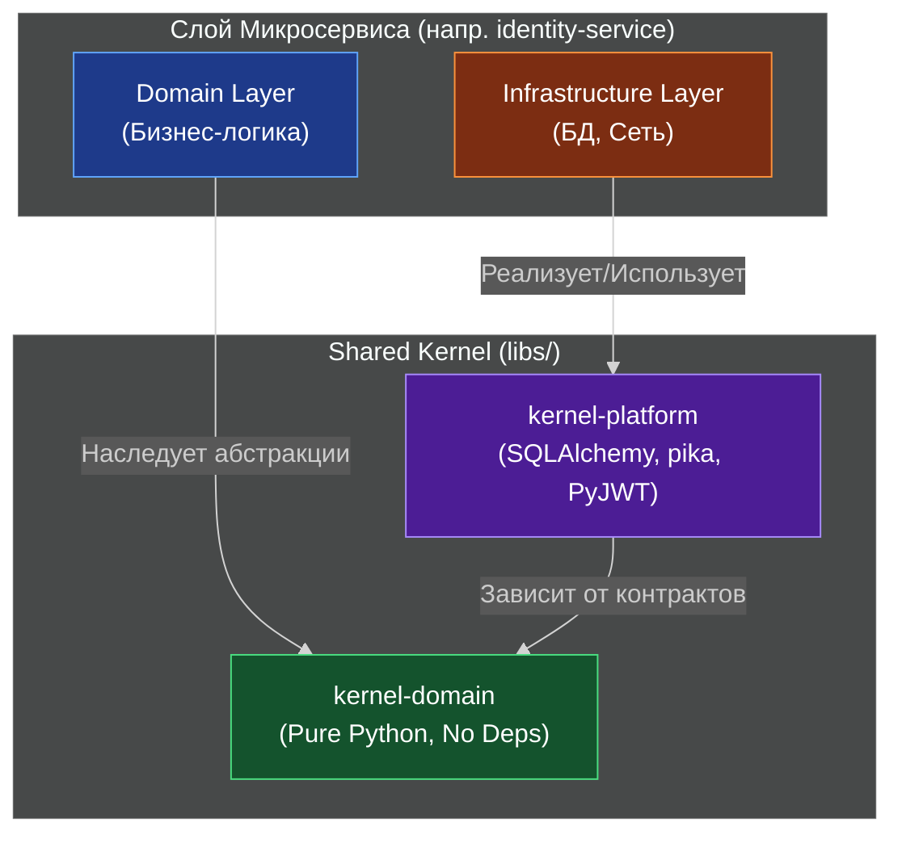

### 8.2. Межсервисная Хореография (Cross-Service Interaction)

Микросервисы общаются между собой исключительно асинхронно через паттерн **Choreography** (Хореография), реагируя на доменные события друг друга. В системе нет центрального оркестратора — каждый сервис сам знает, что делать при наступлении глобального события.

Рассмотрим самый сложный сквозной поток: **Удаление пользователя**.
```mermaid
%%{init: {'theme': 'dark'}}%%
sequenceDiagram
    autonumber
    actor C as Client (User)
    participant IS as identity-service
    participant MQ as RabbitMQ (Topic Exchange)
    participant CS as catalog-worker
    participant SS as support-worker
    
    C->>IS: DELETE /users/me
    
    rect rgb(30, 58, 138)
        note over IS: Транзакция БД (CQRS Command)
        IS->>IS: Перевод статуса в "deleted"
        IS->>IS: INSERT Outbox(user.deleted)
    end
    
    IS-->>C: 202 Accepted (В обработке)
    
    note over IS,MQ: Outbox Relay асинхронно читает БД
    IS->>MQ: Publish RoutingKey: "user.deleted"
    
    par Fan-out (Параллельная обработка)
        MQ-->>CS: Доставка в catalog.users.q
        MQ-->>SS: Доставка в support.users.q
    end
    
    rect rgb(20, 83, 45)
        note over CS: catalog-service бизнес-логика
        CS->>CS: Обновление owner_read_model
        CS->>CS: Скрытие всех товаров пользователя из выдачи
    end
    
    rect rgb(124, 45, 18)
        note over SS: support-service бизнес-логика
        SS->>SS: Анонимизация открытых тикетов
        SS->>SS: Авто-закрытие тикетов (CLOSED)
    end
```

**Преимущества такого подхода:**
Если `catalog-service` в момент удаления пользователя недоступен (упал или обновляется), событие безопасно останется в очереди RabbitMQ. Как только сервис поднимется, консьюмер прочитает событие и скроет товары. Это обеспечивает **Eventual Consistency** (согласованность в конечном счете) без риска каскадного падения системы.

## Транзакции и Unit of Work (ADR 0034)

### 1. Классовая структура (Dependency Inversion)

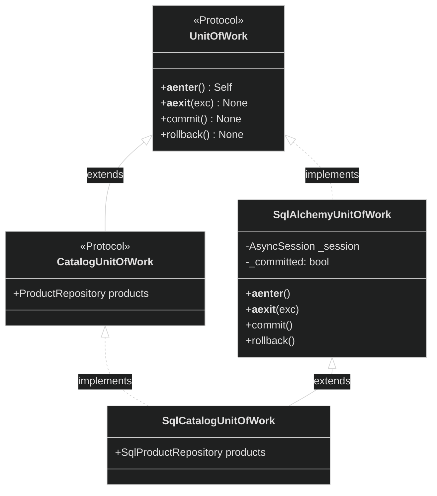

### 2. Жизненный цикл в Command Handler

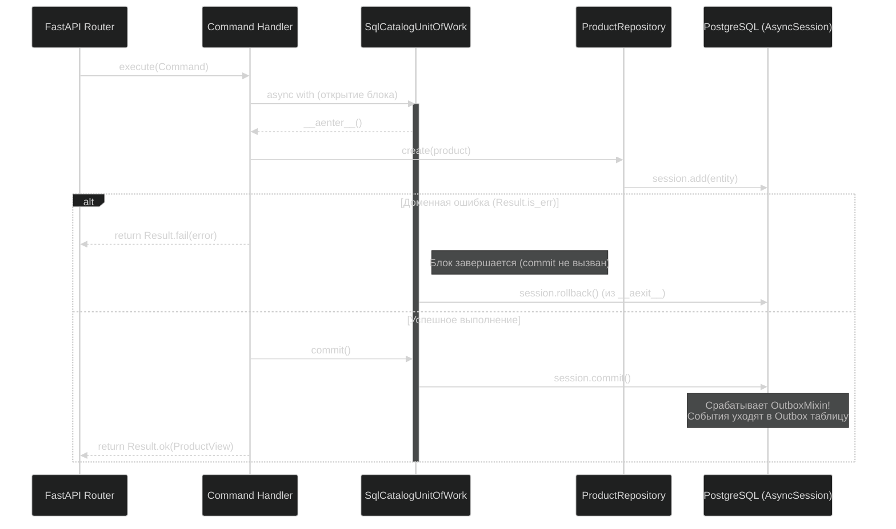
